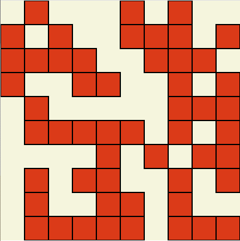
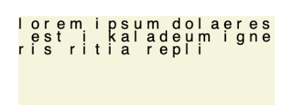

= Spielerisch programmieren lernen mit JavaScript
:toc: left
:toclevels: 3
:tip-caption: 💡
:warning-caption: ⚠️
:source-highlighter: rouge
:docinfo: shared-head,shared-footer
:nofooter:

== Einleitung
In diesem Tutorial wirst du Programmieren lernen. Dabei lernst du die Programmiersprache JavaScript kennen. 
Wir werden JavaScript verwenden um 2D-Grafiken zu zeichnen, Figuren zu animieren und auf Benutzereingaben zu reagieren.

Dieser Ansatz hat folgende Vorteile:

* JavaScript ist sehr weit verbreitet. Du findest in Büchern und im Internet schnell Unterstützung.
* Programme, die in JavaScript geschrieben sind, laufen ohne zusätzliche Vorbereitung auf sehr vielen Plattformen (z.B. Chrome auf Windows oder Firefox auf MacOS).
* Interaktive 2D-Grafiken machen Spass und erleichtern damit den Einstieg in die Programmierung. Denn damit verbunden sind notwendigerweise abstrakte Konzepte.

Am Ende des Tutorials kennst du die grundlegenden Bausteine einer Programmiersprache. Erlernt hast du diese Bausteine am Beispiel von JavaScript. Du kannst damit eigenständig deine Ideen als Computer-Programm realisieren. Diese Bausteine gelten auch für viele andere Programmiersprachen, wie z.B. Python, C# oder Java.

=== Aufbau
Das Tutorial ist in Kapitel unterteilt. In jedem Kapitel lernst du neue Bausteine kennen.
Mit jedem Baustein kannst du komplexere, vielfältigere Programme schreiben.
Pro Kapitel gibt es verschiedene Theorie- und Übungsblöcke, sowie Lernziele.
Zu jeder Übung ist eine korrekte Lösung verlinkt. Das heisst jedoch nicht, dass es die einzige Lösung ist. Es gibt immer mehrere mögliche Lösungen, jede mit ihren eigenen Vor- und Nachteilen.

Die Inhalte beschränken sich auf das minimal notwendige, um die Lernziele zu vermitteln. Für Neugierige sind weiterführende, link:#ressources[empfehlenswerte Lernquellen am Ende] aufgeführt.

=== Werkzeuge / Tools
Um unseren Programmcode, auch Quelltext genannt (engl. Source Code, kurz Code), zu schreiben verwenden wir einen *Texteditor*.
Einen speziellen Texteditor, welcher extra gemacht ist um Programme zu schreiben; eine sogenannte *IDE* (Integrated Development Environment).
Eine IDE ist für Programmierer, wie Word für Berichteschreiber. Eine IDE versteht eine Programmiersprache, sie bietet Hilfestellung bei Schreibfehlern, formatiert den Text und rückt korrekt ein etc.
Es gibt viele verschiedene IDEs, wir verwenden das frei verfügbare Programm "Visual Studio Code" (kurz vscode).

In diesem Tutorial lernen wir zudem *p5.js* kennen. Damit können wir 2D-Grafiken zeichnen. Die ersten Schritte mit p5.js und JavaScript machen wir direkt im Browser. Danach wechseln wir auf vscode.

Um unseren selbst geschriebenen Code auszuführen, also zum Beispiel um die programmierten 2D-Grafiken auf dem Bildschirm anzuzeigen, verwenden wir einen *Browser* (Firefox, Chrome, Safari, Edge, Opera, …).

== Anweisungen & Variablen

=== Anweisungen
Ein Computerprogramm (kurz Programm) besteht aus einer Sequenz von Anweisungen. Jede Anweisung (engl. statement) veranlasst den Computer dazu etwas zu tun. Einige Beispiele:

* Mathematische Berechnung
* Eine Datei einlesen
* Eine Linie zeichnen
* Rückfrage an den Benutzer (z.B. "Sind sie sicher, dass sie diese Datei löschen wollen?")

Im folgenden JavaScript Programmcode ist jede Zeile eine Anweisung.

[source,javascript,linenums]
----
1 + 3
Math.sqrt(25)
"Hallo " + prompt("Wie ist dein Name?")
----

Die Anweisungen werden sequentiell von oben nach unten ausgeführt.

Die erste Zeile weist den Computer an, zwei Zahlen zu addieren, das Ergebnis ist 4.

Die zweite Zeile berechnet die Quadratwurzel (engl. Square Root, sqrt) aus 25, das Ergebnis ist 5.

Die dritte Zeile fragt den User (engl. für Benutzer) nach dem Namen. Hat der User den Namen eingegeben, wird diese Eingabe verwendet und an die Zeichenkette "Hallo " angehängt. Das Ergebnis ist "Hallo <NAME>".

==== Übung – Anweisungen
****
. Öffne einen Browser
. Öffne die https://balsamiq.com/support/faqs/browserconsole/[Entwicklertools]
. Öffne die console in den Entwicklertools
. Führe eine Zeile nach der anderen (der drei Beispiele oben) in der
console aus. Dazu einfach die Zeile eingeben und dann mit der Enter-Taste ausführen.
****

=== Kommentare
Eine spezielle Anweisung ist ein Kommentar. Ein Kommentar ist ein Stück Code, welches vom Computer nicht ausgeführt wird. Kommentare sind dazu da, den restlichen Code zu beschreiben. Sie sind also für den Code-Leser gedacht, für Programmierer selbst.

[source,javascript,linenums]
----
// Addiere 1 und 3
1 + 3
/*
Mehrzeiliger Kommentar ...
...
Ende Kommentar
*/
Math.sqrt(25) // Quadratwurzel von 25
Math./*Kommentar innerhalb einer Anweisung, einfach weil es geht :)*/sqrt(25)
----

TIP: Kommentare sind zu Beginn hilfreich. Später, wenn du die Grundlagen des Programmierens kennst, solltest du Kommentare aber sehr sparsam einsetzen. Als Programmierer ist es nämlich unsere Aufgabe den Code so zu schreiben, dass erläuternde Kommentare kaum notwendig sind.

=== Variablen
Mit einer Variable können Werte gespeichert werden. Das ist sehr praktisch. Denn jede Variable hat einen Namen. So kann man später im Programm via Namen auf den gespeicherten Wert zugreifen.

Das Beispiel der Addition von oben, nun mit Variablen:

[source,javascript,linenums]
----
a = 1
b = 3
summe = a + b
----

Jede Zeile im obigen Beispiel ist eine Anweisung.
Bei allen drei Anweisungen handelt es sich um Variable-Definitionen. Das heisst es wird eine Variable erstellt und der Variable wird mithilfe des Gleicheitszeichens (=) direkt ein Wert zugewiesen (engl. Assignment).

Nachdem die erste Zeile ausgeführt ist, hat die Variable `a` den Wert 1.

Nachdem die zweite Zeile ausgeführt ist, hat die Variable `b` den Wert 3.

Nachdem die dritte Zeile ausgeführt ist, hat die Variable `summe` den Wert 4.

Auf Zeile 3 wird auf die Variablen `a` und `b` zugegriffen und deren Werte werden ausgelesen und für die Addition verwendet.
Man sagt auch, Zeile 3 referenziert die Variablen `a` und `b`.

Weil der Computer die Anweisungen von oben nach unten ausführt, ist es also nicht möglich, Zeile 3 nach oben zu verschieben. Denn dann würde man versuchen auf eine Variable zuzugreifen die es noch gar nicht gibt.

[source,javascript,linenums]
----
a = 1
summe = a + b // Error. Variable b ist nicht definiert
b = 3
----

Allerdings ist es möglich die Zeilen 1 und 2 zu tauschen.

[source,javascript,linenums]
----
b = 3
a = 1
summe = a + b
----

==== Variablenamen / Bezeichner
In JavaScript kann eine Variable einen langen, sprechenden Namen haben. Das ist sehr praktisch. Denn dadurch ist klar, welcher Wert in der Variable gespeichert ist.

Im Folgenden eine Liste von gültigen Namen: `a, name, backgroundColor, first_name`. +
Einige Zeichen sind nicht erlaubt, z.B. Umlaute und die meisten Sonderzeichen. In der Praxis sind die einzigen zwei Sonderzeichen, die man hin und wieder sieht `_, $`.

TIP: Der Name ist frei wählbar und sollte dem Inhalt / Zweck des Wertes der Variable entsprechen. Das macht es deutlich einfacher den Code zu verstehen, wenn man ihn als Mensch liest. Für den Computer selbst hat der Name keinerlei Bedeutung.

==== Variablearten
Die Variable-Definitionen im obigen Beispiel sind kurz und sprechend, es fehlt jedoch ein sehr wichtiges Detail.
In JavaScript gibt es zwei unterschiedliche Variablearten: *veränderbare* und *unveränderbare*, sogenannte Konstanten.

Veränderbaren Variablen kann mehrfach ein Wert zugewiesen werden. Konstanten kann nur einmal ein Wert zugewiesen werden.
Veränderbare Variablen erkennt man an dem <<keyword>> `let`, unveränderbare am Keyword `const`.

[source,javascript,linenums]
----
const a = 1
a = 11    // Error, a ist bereits definiert
let b = 3 // Definition der Variable b
b = 33    // der bestehenden Variable b einen neuen Wert zuweisen
let summe = a + b // summe = 11 + 33 = 44
b = 42
const zweiteSumme = a + b // zweiteSumme = 42 + 11 = 53
// summe = 44
----

Der obige Code läuft nur dann fehlerfrei komplett durch, wenn Zeile 2 gelöscht wird.

Nachdem eine Variable mit `let` definiert wurde, kann ihr zu einem beliebigen späteren Zeitpunkt ein neuer Wert zugewiesen werden; oben auf Zeile 4 und 6.
Die Berechnung auf Zeile 5 wird nur einmal gemacht, das heisst die Zuweisung auf Zeile 6, hat keinen Einfluss auf den Wert der Variable `summe`.

Eine Variabel kann nur einmal definiert werden (mit `let` oder `const`). Danach wird diese nur noch mit dem Namen angesprochen. Entweder für neue Wertzuweisungen, oder um den Wert auszulesen.

WARNING: Es ist wichtig, dass beim Anlegen einer Variable, immer `let` oder `const` verwendet wird.

TIP: Nachdem du in der console eine Variable definiert hast mit `let` oder `const`, kannst du deren Wert einfach abrufen, indem du lediglich den Variablenamen eingibst und Enter drückst.

=== Lernkontrolle
Ich weiss, ...
====
* [*] was eine Anweisung ist
* [*] wie ich eine Variable anlege
* [*] wie ich einer Variable einen Wert zuweise
* [*] welche Variablearten es gibt
====

== 2D Zeichnen
Du bist nun bereit ein neues Kapitel aufzuschlagen: Das Zeichnen und Animieren von zweidimensionalen geometrischen Formen.

Um einen Computer anzuweisen eine Linie zu zeichnen, müssen wir ganz genau sagen wie diese Linie auszusehen hat. Also die Position, Länge, Farbe und Breite der Linie. Die Art und Weise wie wir Position und Länge definieren wird im Folgenden erläutert. Um die Farbe und Breite kümmern wir uns später.

=== Zeichenfläche
Die Zeichenfläche, auf der die Linie entstehen soll, ist ein Rechteck. Dieses Rechteck ist in ein Raster unterteilt (unten im Bild rechts). Ähnlich wie bei einem Blatt Papier mit einem vorgezeichneten Gittermuster. {nbsp} +
Aus dem Mathematikunterricht kennst du etwas ähnliches, das kartesische Koordinatensystem (unten im Bild links). Im Unterschied zum kartesischen System, ist beim Koordinatensystem unserer Zeichenfläche der 0-Punkt ganz oben Links. Es gibt also nur einen Quadranten, und alle Punkte im Koordinatensystem haben positive x- und y-Werte.

image::media/drawing-2d.svg[system,300,300,align=center]

Möchten wir also eine diagonale Linie zeichnen, von oben Links nach unten Rechts, müssen wir eine Möglichkeit finden, dem Computer zu befehlen: {nbsp} +
"Zeichne eine Linie von Punkt (0, 0) bis Punkt (6, 6)".

Um solche Anweisungen geben zu können, müssen wir zuerst ein neues Programmelement kennen lernen: Funktionen.

== Funktionen – Aufrufen
Eine Funktion ist quasi ein eigenständiges Mini-Programm, welches über dessen Namen gestartet werden kann. Über eine Liste von Werten (`Parameter`), können wir dem Mini-Programm genau sagen, was es für uns tun soll.

In JavaScript existieren bereits viele vorgefertigte Funktionen, diese können wir als Programmierer direkt verwenden.

Um eine Linie zu zeichnen können wir zum Beispiel folgenden Code verwenden:

[source,javascript,linenums]
----
const startX = 0
const startY = 0
const endX = 6
const endY = 6
line(startX, startY, endX, endY)
----

Zeile 1-4:
Der Startpunkt ist ganz oben links, dieser hat die Koordinaten (x=0, y=0), kurz (0, 0). Der Endpunkt ist ganz unten rechts, dieser hat die Koordinaten (6, 6).

Auf Zeile 5 wird die Funktion namens `line` aufgerufen. Die Komma-separierten Werte in den Klammern nennt man `Parameter`. Sie beschreiben, was die Funktion konkret tun soll. In diesem Fall beschreiben die ersten beiden Werte die Koordinaten der Startpunks, und die letzten beiden Werte die Koordinaten des Endpunkts.

Es gibt viele weitere nützliche Funktionen. Du hast z.B. ganz zu Beginn die Funktion `Math.sqrt` kennen gelernt. Diese hat nur einen Parameter. Nämlich die Zahl von der man gerne die Quadratwurzel berechnet haben möchte. Die Funktion `line` hat 4 Parameter. Es gibt auch Funktionen ohne Parameter, und sogar welche, bei der die Anzahl der Parameter variabel ist.

=== Übung – Funktionen aufrufen
Ein kleines Beispiel mit der Funktion `prompt`, welche du ebenfalls bereits kennengelernt hast zu Beginn.

****
*Prompt*

Was ist der Unterschied der folgenden beiden Zeilen? Wie wirkt sich dieser Unterschied aus, wenn du die beiden Zeilen ausführst?

[source,javascript,linenums]
----
prompt()
prompt("Wie heisst du?")
----

.Lösung (Click)
[%collapsible]
====
Zeile 1 ruft die Funktion prompt auf, ohne Parameter. Als Ergebnis wird ein Eingabe-Dialog angezeigt ohne textuelle Aufforderung, sondern lediglich mit einem Eingabefeld. {nbsp} +
Zeile 2 zeigt einen Eingabe-Dialog mit textueller Aufforderung.
====

****

Das tolle an Funktionen ist, dass man sie beliebig oft nacheinander aufrufen kann. Möchte man also von drei verschiedenen Zahlen die Quadratwurzel ziehen kann man die Funktion einfach dreimal aufrufen, jedesmal mit einem anderen Parameter:

[source,javascript,linenums]
----
Math.sqrt(25)
Math.sqrt(36)
Math.sqrt(2)
// Ich kann sogar die Wurzel einer Wurzel berechnen:
let nine = Math.sqrt(81)
let three = Math.sqrt(nine)
// Oder noch kürzer:
three = Math.sqrt(Math.sqrt(81))
----

'''

Als nächstes lernen wir ein Werkzeug kennen, welches die Funktion `line` ausführen kann und eine Linie auf den Bildschirm zeichnet. Denn wenn du den Code von oben kopierst und direkt im Browser ausführst, wird das einen Fehler geben. Der Grund ist, dass es die Funktion `line` nicht gibt. Zudem gäbe es auch noch keine Zeichenfläche ;).

=== Lernkontrolle
Ich weiss, ...
====
* [*] was eine Funktion ist
* [*] was ein Parameter ist
* [*] wie ich eine Funktion aufrufe
====

[#p5]
== p5.js – Einführung
Im Folgenden siehst du ein einfaches Programm, welches mithilfe von p5.js eine Linie zeichnet. Klicke auf "Play" um das Programm auszuführen und das Ergebnis zu sehen.

++++

++++
{nbsp} + 

Cool! Aber was geschieht da genau?

. Die Funktion `createCanvas` erstellt eine Zeichenfläche. Diese ist 200 Einheiten (sogenannte <<Pixel>>) breit und 200 Einheiten hoch.
. Mit `background` setzen wir die Hintergrundfarbe der Zeichenfläche. `skyblue` ist eine Farbbezeichnung die der Computer kennt.
. Mit `line` zeichnen wir dann die diagonale Linie, von oben links nach unten rechts.

=== Übung – 2D Zeichnen
Du kannst diese Übungen direkt im obigen Editor lösen. Empfohlen wird jedoch, diese Übungen in der Visual Studio Code IDE zu lösen. Folge der Anleitung in dem Kapitel link:#vscode-setup[Editor für p5.js Übungen], um Visual Studio Code einzurichten.

Wichtige Ressourcen:

* Formen zeichnen: https://processing.org/tutorials/drawing
* Vollständige Dokumentation aller Funktionen von p5.js: https://p5js.org/reference

****
*Linie*

Zeichne eine zweite Linie von unten links nach oben rechts.

*Farben*

. Verändere die Hintergrundfarbe. Auswahl an Farbnamen https://www.w3schools.com/colors/colors_names.asp
. Verändere die Linienfarbe. Zeichne Linien in verschiedenen Farben. +
Hinweis: Die `stroke` Funktion

*Farben & Formen*

Zeichne:

+++
<iframe src="p5-sketches/index.html?s=u-pendel" style="border:0; height: 200px;"></iframe>
+++
+++
<a href="p5-sketches/u-pendel.js" class="source-code-link">Source Code anzeigen</a>
+++

*Symbol*

Zeichne selbst etwas bestimmtes. z.B. ein Haus oder ein Ying-Yang Symbol oder was dir gerade in den Sinn kommt :).

Inspiration:

+++
<iframe src="p5-sketches/index.html?s=u-peace" style="border:0; height: 200px;"></iframe>
+++
+++
<a href="p5-sketches/u-peace.js" class="source-code-link">Source Code anzeigen</a>
+++

https://www.wihel.de/wie-das-peace-symbol-entstanden-ist/

****

=== Lernkontrolle
Ich weiss, ...
====
* [*] wie ich eine Linie, ein Kreis und ein Rechteck zeichne
* [*] wie ich die Farben und Linienstärke von Formen verändere
====

Du hast nun einiges gelernt und kannst 2D zeichnen mit p5.js. Das nächste Ziel ist das Erstellen von interaktiven Programmen, welche anhand von Benutzereingaben ihr Verhalten verändern, und so zum Beispiel auf einen Mausklick reagieren. Bevor wir das tun können, musst du dir aber noch ein wenig Theorie aneignen.

== Datentypen I

In einem Programm werden Daten verarbeitet. Diese Daten können unterschiedlicher Art sein. Es können zum Beispiel Zahlen sein. Oder eine Liste von Namen. Als Programmierer ist es wichtig, dass man genau weiss, für was man die Daten braucht, denn daraus leitet sich ab, welchen Datentyp man verwendet.

Mit Zahlen kann ich andere Dinge anstellen als mit einer Liste von Namen.
Es macht z.B. keinen Sinn zwei Namen zu einer Summe zu addieren. Sehr wohl kann es aber Sinn machen, zwei Zahlen zu einer Summe zu addieren.

In JavaScript hat jede Variable einen Datentyp. Genauer: Der Wert, welcher einer Variable zugewiesen wird hat einen Datentyp, die Variable übernimmt diesen Datentyp automatisch bei der Zuweisung.

Zwei wichtige Datentypen werden hier vorgestellt. Später lernen wir noch einige mehr kennen.

=== Zahlen (Number)
Damit können Ganzzahlen (sogenannte `Integer`) oder Fliesskommazahlen (sogenannte `Floats`) abgebildet werden. In JavaScript gibt es den Datentypen `Number`, welcher sowohl Floats als auch Integer beinhaltet.

[source,javascript,linenums]
----
const r = 14
const pi = 3.14
const area = pi * r**2
// area = 3.14 * 14 * 14 = 615.44
----

=== Zeichenketten (String)
Wird verwendet um eine beliebige Anzahl von Zeichen zu speichern. z.B. einen Personennamen, eine Automarke oder ein Gedicht.

[source,javascript,linenums]
----
const greeting = "Hallo!"
const brand = "Mercedes Benz"
----

Mit dem `+` Zeichen ist es möglich zwei Strings miteinander zu verbinden, und damit einen neuen String zu erzeugen.

[source,javascript,linenums]
----
const greeting = "Hallo"
const name = " Mrs. Simpson"
const text = greeting + name
// text ist jetzt "Hallo Mrs. Simpson"
// greeting und name bleiben unverändert
----

TIP: Mit dem Keyword `typeof` kannst du den Datentypen eines Wertes abfragen. z.B. `typeof "23"` ergibt `"string"`, `typeof 23` ergibt `"number"`.

==== Typen kombinieren

Eine Zahl kann ebenfalls in einer Zeichenkette gespeichert werden.
Dann kann man damit aber nicht mehr rechnen.

Folgendes ist also keine gültige Addition:

[source,javascript,linenums]
----
const summe = "3.14" + 5
----

Hingegen kann eine Zahl immer automatisch zu einem String umgewandelt werden. Folgendes ist also sinnvoll:

[source,javascript,linenums]
----
const temp = 35.8
const text = "Temperatur: " + temp
----

=== Boolean & Vergleiche
Ein Algorithmus muss oft Entscheidungen treffen. So muss ein Sortieralgorithmus zum Beispiel zwei Zahlen vergleichen und entscheiden welches der beiden Zahlen zuerst kommen soll.
Im folgenden Beispiel entscheidet ein Algorithmus, ob noch genug Geld auf dem Konto verfügbar ist, um einen Einkauf zu tätigen.

[source,javascript,linenums]
----
const accountBalance = 3000 // Kontostand
const articlePrice = 2850
// ist genug Geld auf dem Konto um Artikel zu kaufen?
const canBuy = acccountBalance > articlePrice
// canBuy = true
----

Auf Zeile vier werden zwei Werte verglichen. Das Ergebnis ist entweder "ja" oder "nein". Ein Datentyp, welcher nur diese beiden Werte kennt, nennt man `Boolean`. In JavaScript entspricht "ja" dem Wert `true` und "nein" dem Wert `false`.
Im obigen Beispiel hat also die Variable `canBuy` den Wert `true`.

Nebst > ist auch <, >= und \<= möglich.

==== Gleichheit prüfen
Um zu prüfen ob zwei Werte gleich sind, wird in JavaScript `===` verwendet.

Einige einfache Beispiele:

[source,javascript,linenums]
----
23 === 23 // true
const a = 2
const x = a === 2   // true
const y = a === "2" // false, weil ein String nie gleich einer Number ist
----

Im folgenden Beispiel wird direkt innerhalb des Vergleichs eine Operation (`%` – Modulo) ausgeführt, und dann das Ergebniss der Operation geprüft, ob diese den Wert 0 ergab.

[source,javascript,linenums]
----
const anyNumber = 23
const isEven = anyNumber % 2 === 0
// isEven = false
----

Im obigen Beispiel ist die Variable `isEven` nur dann true, wenn der Wert von `anyNumber` eine gerade (engl. even) Zahl ist. Der Modulo Operator (`%`) berechnet den Rest einer Division.

===== Ungleichheit prüfen

Möchte man prüfen ob ein Wert ungleich einem anderen Wert ist, verwendet man den `!==` Operator.

[source,javascript,linenums]
----
const anyNumber = 23
const isOdd = anyNumber % 2 !== 0
// isOdd = true
----

==== Logische Ausdrücke

Boolean Werte kann man auch miteinander verknüpfen. Zwei häufig verwendete Operationen sind `und` (engl. and) und `oder` (engl. or).
Es geht also darum logische Aussagen, die entweder wahr oder falsch sind, miteinander zu kombinieren. Das Ergebnis ist dann wiederum ein boolscher Wert.

===== OR

Folgendes Beispiel illustriert die `or` Operation:

Ein Online-Shop gewährt 10% Rabatt, wenn die Kundin weniger als 20 Jahre alt ist, oder wenn die Kundin mehr als 300.- CHF im Warenkorb hat. Im Code könnte man das so abbilden:

[source,javascript,linenums]
----
const basketTotal = 344.65
const yearOfBirth = 1980
const youngerThan20 = (today('year') - yearOfBirth) < 20
const has10Discount = basketTotal > 300 || youngerThan20
----

Auf Zeile 4 werden zwei boolsche Werte mit `or` kombiniert. In JavaScript wird dafür der `||`-Operator verwendet. `has10Discount` ist also immer nur dann true, wenn mindestens ein Operand true ist. Der `or` Operator hat zwei Operanden, einer links und einer rechts vom `||`-Zeichen.

****
*Quizfrage* {nbsp} +
Wie kannst du `basketTotal` oder `yearOfBirth` ändern, damit `has10Discount` false wird?

.Lösung (Click)
[%collapsible]
====
`basketTotal` auf kleiner gleich 300. `yearOfBirth` ist bereits so gesetzt, dass false rauskommt.
====
****

===== AND

Folgendes Beispiel illustriert die `and` Operation:

Gefragt sind alle Zahlen, welche gerade sind und durch vier teilbar:

[source,javascript,linenums]
----
const number = 23
const goodNumber = number % 2 === 0 && number % 4 === 0 
----

Auf Zeile 2 werden zwei boolsche Werte mit `and` kombiniert. In JavaScript wird dafür der `&&`-Operator verwendet.

===== NOT

Mit dem `!`-Operator ist es möglich einen Boolean Wert zu negieren.

[source,javascript,linenums]
----
const anyNumber = 23
const isEven = anyNumber % 2 === 0
const isOdd = !isEven
const isOdd1 = !(anyNumber % 2 === 0)
----

Auf Zeile 3 wird der `!`-Operator verwendet um einen Boolean Wert zu negieren. In diesem Fall ist `isEven = false`. Der negierte Wert von _false_ ist _true_, dieser Wert wird der Variable `isOdd` zugewiesen: `const isOdd = !false`

Auf Zeile 4 wird der `!`-Operator verwendet, um das Boolean Ergebnis eines ganzen logischen Ausdrucks zu negieren. Wichtig hierbei ist, dass der gesamte zu negierende Ausdruck in runden Klammern steht.

===== Verkettung

Es können beliebig viele boolean Werte miteinander kombiniert werden. Möchte man _und_ und _oder_ miteinander mischen, ist zu empfehlen die Teilausdrücke in `runde Klammern` zu setzen, oder in eine `Variable` auszulagern. Ansonsten kann es sehr schnell zu unbeabsichtigten Ergebnissen führen.

Im Folgenden geht es darum zu entscheiden, ob jemand Alkohol kaufen darf, abhängig von seinem Geschlecht und Alter. Die Aufgabe des Programmes ist es, nur dann Alkoholverkauf zuzulassen, wenn die Person älter als 18 Jahre ist und entweder männlich oder weiblich ist.

[source,javascript,linenums]
----
const minAge = 18
let clientAge = 23
let clientSex = "male"

const canBuyAlcohol1 = clientAge > minAge && clientSex === "male" || clientSex === "female"
                  // = true && true || false
                  // = true || false
                  // = true

clientAge = 23
clientSex = "female"
const canBuyAlcohol2 = clientAge > minAge && clientSex === "male" || clientSex === "female"
                  // = true && false || true // implizit: (true && false) || true
                  // = false || true         // ⚠️ kann nur kaufen, weil weiblich 
                  // = true

clientAge = 16
clientSex = "female"
const canBuyAlcohol3 = clientAge > minAge && clientSex === "male" || clientSex === "female"
                  // = false && false || true // implizit: (false && false) || true
                  // = false || true          // ⚠️ kann nur kaufen, weil weiblich
                  // = true

// Korrekte Lösung: indem Klammern verwendet werden
clientAge = 7
clientSex = "female"
const canBuyAlcohol4 = clientAge > minAge && (clientSex === "male" || clientSex === "female")
                  // = false && (false || true)
                  // = false && true           // ✅
                  // = false                   // ✅

// Korrekte Lösung: indem eine Variable verwendet wird
clientAge = 7
clientSex = "female"
const hasValidSex = clientSex === "male" || clientSex === "female"
const canBuyAlcohol5 = clientAge > minAge && hasValidSex
                  // = false && true           // ✅
                  // = false                   // ✅
----

Im Beispiel 2 und 3 kommt es zu einem falschen Ergebnis. Der Grund: der Computer evaluiert zuerst das Ergebnis aller _und_ Operatoren. Und erst dann werden die _oder_ Operatoren ausgewertet. Der Computer setzt also implizit jede `&&`-Verknüpfung in Klammer und berechnet zuerst den Klammerinhalt.
{nbsp} + 
So ähnlich wie die altbekannte Eselsbrücke beim Multiplizieren und Addieren: "Punkt vor Strich", heisst es hier: "Und vor Oder".

=== Lernkontrolle
Ich weiss, ...
====
* [*] dass ich nur Variablen mit gleichem Datentyp vergleichen kann
* [*] was ein logischer Ausdruck ist
* [*] wie ich logische Ausdrücke korrekt kombiniere
* [*] den Unterschied von Integer und Float
* [*] wie ich Strings kombinieren kann
====

== p5.js - Animationen
Bevor wir mit p5.js bewegte Bilder zeichnen können, müssen wir p5.js noch etwas vertiefter kennen lernen.

Sämtliche p5.js Programme beinhalten Anweisungen, welche in zwei Gruppen aufgeteilt werden können: Einmal ausgeführte und wiederholt ausgeführte.

*Einmal ausgeführt*: Werden beim Programmstart einmalig ausgeführt, dann nie wieder. {nbsp} +
*Wiederholt ausgeführt*: Werden automatisch alle par Millisekunden ausgeführt.

Bis jetzt hatten wir nur mit einmal ausgeführten Programmen zu tun. Du hast im Editor einmal auf den `Run`-Button gedrückt und die Zeichnung wurde erstellt. Die Aufgabe des Programms war damit erledigt.

Möchten wir jetzt aber, dass sich das Bild verändert (ohne das wir erneut Run drücken), brauchen wir eine Gruppe von Befehlen, welche automatisch wiederholt ausgeführt wird, und unter bestimmten Bedingungen unser Bild verändert.

Folgendes Beispiel zeigt eine Animation. Der Kreis wächst.

++++

++++

{nbsp} +

Alle einmal ausgeführten Anweisungen werden in der Funktion `setup` platziert.
Alle wiederholt ausgeführten Anweisungen werden in der Funktion `draw` platziert. Die Funktion draw wird automatisch alle ca. 17 Millisekunden ausgeführt (60 mal pro Sekunde). Für uns Menschen sieht die Animation trotzdem flüssig aus, weil das menschliche Auge ein ruckeln / flimmern nur dann erkennt, wenn das Bild weniger als 25 mal pro Sekunde gezeichnet wird.

Die Namen der Funktionen müssen genau so heissen, wie im Code oben. Denn nur dann "weiss" p5.js welche Anweisungen einmalig oder wiederholt ausgeführt werden müssen. Man spricht auch von einer `Namenskonvention`, welche vom `Framework` (p5.js), als Rahmenbedingung (engl. frame = Rahmen) vorgegeben wird.

TIP: Das ist das erste mal dass du siehst, wie man eine Funktion selbst erstellt. Vorerst lassen wir es dabei, es reicht wenn du innerhalb der Funktionen deine Anweisungen korrekt platzieren kannst. link:#functions-define[Mehr Details zu Funktionen folgen später].

=== Übung – 2D Animationen

****
*Ruckel*

Verwende im Beispiel oben die Funktion `frameRate`, um eine ruckelnde Animation zu erstellen.

*Floating Rect*

Zeichne ein Rechteck, welches sich automatisch von ganz Links nach ganz Rechts bewegt. Es ist egal, wenn es dann rechts aus dem Bild verschwindet.

+++
<a href="p5-sketches/u-floating-rect.js" class="source-code-link">Source Code anzeigen</a>
+++

*Pixel Screen*

Stelle dir vor die Zeichenfläche sei in ein regelmässiges Gitternetz unterteilt. Generiere bei jedem `draw` Aufruf ein Quadrat und platziere dieses an einer zufälligen Position im Gitternetz. Du kannst die Anzahl der Positionen (resp. die Quadratgrösse) selbst bestimmen. (Zum Beispiel: Bei einer Zeichenfläche von 200x200 und einer Positionsgrösse von 20x20 pro Quadrat ergibt das im Total 10x10 = 100 Positionen). {nbsp} +
Beachte: Die Quadrate dürfen sich nicht überschneiden und jedes Quadrat muss komplett in der Zeichenfläche liegen.

Hinweis: Die `random` Funktion

_Zusatzaufgabe_ {nbsp} +
Ändere die Farbe für jedes Quadrat indem du mit RGB arbeitest. Zum Thema p5.js und Farben: https://p5js.org/learn/color.html

Vorschau:

+++
<a href="p5-sketches/u-pixel-screen.js" class="source-code-link">Source Code anzeigen</a>
+++

****

== Ereignisse
Sobald ein Programm, während dem es läuft, auf äussere Einflüsse reagieren muss, kommen Ereignisse (engl. `Events`) ins Spiel. Beispiele für Ereignisse:

- Linke Maustaste geklickt
- Enter Taste gedrückt
- Fenstergrösse hat geändert
- Systemzeit hat geändert

Eine Applikation, ein Programm, welches von einem Anwender bedient wird, muss zwangsläufig mit dem Anwender interagieren, um zum Beispiel auf Mausklicks reagieren zu können.

Im Folgenden ein Beispiel in p5.js:

+++
<iframe src="p5-sketches/index.html?s=events-demo" style="border:0; height: 100px;"></iframe>
+++
+++
<a href="p5-sketches/events-demo.js" class="source-code-link">Source Code anzeigen</a>
+++

Bei jedem Click wird die Hintergrundfarbe geändert. Sowie die angezeigte Anzahl Clicks um eins erhöht.

Damit wir in JavaScript auf Ereignisse reagieren können, brauchen wir einen `EventHandler`, das ist eine Funktion, welche vom Computer automatisch aufgerufen wird, sobald das entsprechende Ereignis auftritt.

=== p5.js – Interaktiv
In p5.js ist es möglich auf Events zu reagieren. Dies geschieht wiederum über Funktionen, welche einer Namenskonvention folgen.

Um auf einen Mausklick zu reagieren, wird eine Funktion mit dem Namen `mouseClicked` verwendet. Ist diese im Programmcode vorhanden, wird diese automatisch von p5.js aufgerufen, sobald der User mit der Maus auf die Zeichenfläche klickt. Diese Funktion ist also der `EventHandler` des Click Events.

+++

+++

=== Übung – Ereignisse

****

*Mouse Deco*

Ersetze den Mauszeiger durch einen roten Punkt, während dieser sich über die Zeichenfläche bewegt.

Hinweis: Die Funktion `noCursor`

+++
<a href="p5-sketches/u-mouse-deco.js" class="source-code-link">Source Code anzeigen</a>
+++

*Typewriter* 

Bei jedem Tastendruck eines Buchstabens oder einer Zahl, schreibe den Wert der Taste (z.B. a oder 2) auf die Zeichenfläche. Beginne Links oben und füge bei jedem Tastendruck ein Zeichen rechts hinzu. Am Ende der Zeichenfläche beginnt automatisch eine neue Zeile. {nbsp} +
Sonderzeichen, Backspace und Enter etc. musst du nicht berücksichtigen.

Hinweis: Die Funktionen `keyTyped` und `floor`

Vorschau:

+++
<a href="p5-sketches/u-typewriter.js" class="source-code-link">Source Code anzeigen</a>
+++

****

=== Lernkontrolle
Ich weiss, ...
====
* [*] was ein EventHandler ist
* [*] wie ich in p5.js auf Tastatur- oder Maus-Ereignisse reagiere
====

== Verzweigungen – Bedingte Ausführung

Ein Weiterer wichtiger Baustein von Programmen sind Verzweigungen. Damit ist es möglich gewisse Anweisungen nur bedingt auszuführen.

Denken wir an ein Ballon-Treff-Spiel: Ein Kreis ändert ständig seine Position. Der Spieler bekommt einen Punkt, wenn er mit der Maus in den Kreis klickt. Klickt er ausserhalb des Ballons, gibt es keine Punkte. Die Anweisung "Erhöhe Punktezahl um eins" wird also bedingt ausgeführt. Die Bedingung ist "Click erfolgte auf Ballon".

In <<Pseudo-Code>> könnte man das so formulieren:

[source,javascript,linenums]
----
Wenn "Click erfolgte auf Ballon":
    "Erhöhe Punktezahl um eins"
Sonst:
    "Tue nichts"
----

Die Anweisung auf Zeile 2 wird nur ausgeführt, wenn die Bedingung auf Zeile 1 wahr (true) ist.
Ist die Bedingung auf Zeile 1 nicht wahr (false), dann wird nur die Anweisung auf Zeile 4 ausgeführt.

Die allgemein gültige <<Syntax>>, um eine solche Bedingung in JavaScript zu formulieren ist wie folgt:

[source,javascript,linenums]
----
if (<<Bedingung>>) {
    <<Anweisungen>>
} else {
    <<Anweisungen>>
}
----

TIP: Dieses Beispiel verwendet Platzhalter (mit << und >> gekennzeichnet). Es ist also nicht lauffähig, sondern illustriert die allgemein gültige Syntax in JavaScript.

Erläuterung:

Zeile 1:: Das Keyword um eine bedingte Ausführung einzuleiten ist `if` (engl. falls) {nbsp} +
Zeile 1:: Die runden Klammern (engl. Parentheses) sind zwingend nötig. Sie umfassen die ganze Bedingung. Eine Bedingung kann z.B. ein Vergleich `(a < 2)` sein. Eine Bedingung ist immer entweder true (wahr, zutreffend) oder false (nicht wahr, falsch). {nbsp} +
Zeile 1:: Die geschweifte Klammer (engl. Brace) eröffnet einen `Block`. Der Block reicht bis zu der ersten schliessenden geschweiften Klammer auf Zeile 3. Alle Anweisungen die sich innerhalb dieser beiden Klammern befinden, werden nur dann ausgeführt, wenn die Bedingung wahr ist. {nbsp} +
Zeile 2:: Eine oder mehrere Anweisungen, die bedingt ausgeführt werden.
Zeile 3:: Schliesst den Block, welcher auf Zeile 1 geöffnet wurde. Eröffnet einen neuen Block, welcher nur dann ausgeführt wird, wenn die Bedingung nicht wahr ist. Zwischen den beiden Blöcken muss das Keyword `else` (engl. sonst) stehen. {nbsp} +

Hier nun ein lauffähiges Beispiel:

[source,javascript,linenums]
----
let a = 2
if (a < 0) {
    a = 0
} else {
    a = a * 2
}
----

Eine bedingte Ausführung kann auch ohne else-Verzweigung definiert werden:

[source,javascript,linenums]
----
let a = 2
if (a < 0) {
    a = 0
}
----

Im Weiteren spielt es keine Rolle wie viel Leerzeichen oder Zeilenumbrüche verwendet werden. Wichtig sind die Steuerzeichen (z.B. Klammerpaare) und Keywords. Folgender Code ist also äquivalent, allerdings schlechter lesbar:

[source,javascript,linenums]
----
let a=2
if(a <0)            {  a = 0

}
----

=== Übung – Bedingte Ausführung

****
*Floating Rect Bounded*

Zeichne ein Rechteck, welches sich automatisch von ganz Links nach ganz Rechts bewegt …

. Sobald es den rechten Rand berührt, stoppt es.

. Sobald es den rechten Rand berührt, prallt es ab und bewegt sich nach links. Sobald es den linken Rand berührt, prallt es wieder ab und geht nach rechts. Bis es da wieder abprallt …

Zusatzaufgabe: Löse das Problem ohne `if`. Hinweis: Die Funktion `min`.

+++
<a href="p5-sketches/u-floating-rect-boundary.js" class="source-code-link">Source Code anzeigen</a>
+++

*Catch me*

. Zeichne einen Kreis. Wenn der Spieler daneben klickt, bekommt er einen Punkt Abzug. Weniger als 0 Punkte geht nicht. {nbsp} +
Wenn der Spieler auf den Kreis klickt:
    .. bekommt er einen Punkt
    .. ändert der Kreis seine Position auf eine zufällige, neue Position

. Der Kreis ändert (zusätzlich) alle par Sekunden automatisch seine Position

. Die Grösse des Kreises ändert bei jedem Treffer.

Hinweis: `dist`, `random`, `frameRate`

+++
<a href="p5-sketches/u-catchme-minimal.js" class="source-code-link">Source Code anzeigen (minimale Lösung)</a>
<a href="p5-sketches/u-catchme-fancy.js" class="source-code-link">Source Code anzeigen</a>
+++

****

=== Lernkontrolle
Ich weiss, ...
====
* [*] wie ich Programmteile nur bedingt ausführe
* [*] was die Keywords if und bedeuten
====

== Blöcke & Geltungsbereiche

Im Zusammenhang mit Verzweigungen haben wir das erste mal Blöcke verwendet. Ein Block besteht aus einer Liste von Anweisungen, welche von geschweiften Klammern (engl. Brace) umschlossen sind.

Theoretisch ist es also möglich einen Block zu definieren, auch ohne das man eine Verzweigung verwendet. Das sieht dann so aus:
[source,javascript,linenums]
----
let a = 0
{
    let b = 0
}
let c = 0
----

Im obigen Beispiel beginnt der explizit definierte Block auf Zeile 2 und geht bis Zeile 4. In JavaScript existiert immer auch ein impliziter Block: der, welcher das ganze Programm beinhaltet.

Ein Block kann einen anderen Block beinhalten. Man spricht dann von Verschachtelung:

[source,javascript,linenums]
----
let a = 0
{
    let b = 0
    {
        let b1 = 0
    }
}
let c = 0
----

Im obigen Beispiel beginnt auf Zeile 4 der verschachtelte Block und geht bis Zeile 6.

In der Praxis werden Blöcke selten allein verwendet, sondern zum Beispiel in Kombination mit Verzweigungen. Eine einfache Verzweigung kennen wir bereits. Hier nun ein Beispiel einer verschachtelten Verzweigung:

[source,javascript,linenums]
----
let a = 0
if (a > 0) {
    if (a <= 10) {
        // a >= 1 und <= 10
    } else {
        // a > 10
    }
} else {
    // a <= 0
}
----

=== Formatierung

Im Zusammenhang mit Blöcken wird gut sichtbar, wie hilfreich gut formatierter Code für uns Menschen ist. Es ist wie bei Texten in Büchern oder Zeitungen auch: Ein geordnetes Gesamtbild mit genügend Leerräumen (engl. whitespace) erhöht die Lesbarkeit und erfordert weniger Aufwand, um den Text zu verstehen.

Gut formatiert heisst:

* Pro Verschachtelungs-Stufe wird der gesamte Blockinhalt nach rechts eingerückt
* Abstände zwischen Steuerzeichen und Variablen ist einheitlich
* Zeilenumbrüche zwischen Steuerzeichen einheitlich

Das obige Beispiel ohne einheitliche Einrückung:

[source,javascript,linenums]
----
let a = 0
if (a > 0) {
if (a <= 10) {
  // a >= 1 und <= 10
    } else {
// a > 10
        }
} else {
        // a <= 0
    }
----

Das obige Beispiel ohne einheitliche Zeilenumbrüche und ohne einheitliche Abstände:

[source,javascript,linenums]
----
let a = 0
if ( a >0 )
{
    if ( a<=10) {
        // a >= 1 und <= 10
    }
    else {
        // a > 10
    }
}else{
    // a <= 0
}
----

TIP: Eine wichtige Funktion von IDEs ist die automatische Code-formatierung. Direkt bei der Eingabe, oder via Tastenkombination / Menüpunkt kann die ganze Datei automatisch korrekt formatiert werden.

=== Geltungsbereich

WARNING: In diesem Kapitel behandeln wir nicht alle Aspekte von Geltungsbereichen, sondern nur das minimal nötige für diesen Einführungskurs. Gewisse Definitionen / Erläuterungen sind daher nicht vollständig korrekt.

Blöcke dienen nicht nur der Formatierung und Gruppierung von Anweisungen. Blöcke definieren ebenfalls einen Geltungsbereich (engl. scope) für Variablen. Der Geltungsbereich einer Variable ist eine Reihe von Zeilen, in denen auf die Variabel zugegriffen (referenziert) werden kann. Der Gültigkeitsbereich einer Variabel startet auf der Zeile, auf der diese definiert wird, und geht bis an das Blockende.

Erinnern wir uns an das Beispiel von oben:

[source,javascript,linenums]
----
let a = 0
{
    let b = 0
}
let c = 0
----

* Der Geltungsbereich von `a` geht von Zeile 1 bis und mit 5.
* Der Geltungsbereich von `b` geht von Zeile 3 bis und mit 3.
* Der Geltungsbereich von `c` geht von Zeile 5 bis und mit 5.

Das impliziert:

* Geltungsbereiche beinhalten verschachtelte Blöcke
* Variablen, welche in verschachtelten Blöcken definiert werden, sind in äusseren Blöcken nicht referenzierbar

Diese Tatsachen mit Kommentaren in einem Codebeispiel erläutert:

[source,javascript,linenums]
----
// Zugriff auf a nicht erlaubt, da noch nicht definiert
let a = 0
{
    // Zugriff auf a erlaubt, da im äusseren Block definiert
    let b = 0
}
// Zugriff auf b nicht erlaubt, da im inneren Block definiert
// Zugriff auf a erlaubt, da im gleichen Block, davor definiert
let c = 0
----

=== Lernkontrolle
====
* [*] In einem Stück Code kann ich den Geltungsbereich einer Variable bestimmen
* [*] Ich kenne die Kriterien korrekter Formatierung und kann diese anwenden
====

== Schleifen

Eine weiterer wichtiger Baustein von Programmiersprachen sind Schleifen. Damit kann man eine Liste von Befehlen wiederholt ausführen. Es gibt verschiedene Schleifentypen. Die einfachste davon ist die `while`-Schleife.

=== while Schleife

Eine `while`-Schleife besteht lediglich aus einer `Abbruchbedingung` und einer Liste von wiederholt ausgeführten Anweisungen, dem Schleifeninhalt (engl. `Body`).

[source,javascript,linenums]
----
const stop = 3
let counter = 0
while(counter < stop) { // Abbruchbedingung
    text("Counter: " + counter, 10, 10)
    counter = counter + 1
}
----

Im Beispiel oben, werden die Zeilen 4 und 5 insgesamt 3 mal nacheinander ausgeführt. Begonnen wird mit `counter = 0`. Der letzte Durchgang wird mit `counter = 2` ausgeführt. {nbsp} +
Der Computer wiederholt also den Schleifeninhalt solange, bis die Abbruchbedingung `false` ist. Ist diese `false`, wird die Schleife nicht mehr ausgeführt. Der Computer führt dann die nächste Anweisung nach der Schleife aus, bzw. beendet das Programm, wenn nach der Schleife keine weitere Anweisung folgt.
{nbsp} +
Die Zeile 3 wird also 4 mal ausgeführt. Denn erst bei deren vierten Ausführung ist die Bedingung `false` und somit wird der Schleifeninhalt kein weiteres mal ausgeführt.

Im Folgenden eine Tabelle, welche den Zustand des Programms bei jedem Schleifendurchgang darstellt. Also den Zustand der Variablen, jedes mal unmittelbar bevor Zeile 3 ausgeführt wird.

[%header,cols="1,1,1,1,2"] 
|===
|Durchgangs-Nr
|counter
|stop
|counter < stop
|Aktion

|1|0|3|true|Counter: 0, counter + 1
|2|1|3|true|Counter: 1, counter + 1
|3|2|3|true|Counter: 2, counter + 1
|4|3|3|false|
|===

TIP: Es gibt weitere Schleifentypen (`for`, `do while`). Für die allermeisten Aufgaben reicht eine simple `while` Schleife jedoch bestens. Später, im Zusammenhang mit Arrays, lernst du den Schleifentypen `for of` kennen.

=== Übung – Schleifen

****
*Split*

[loweralpha]
. Zeichne einen schwarzen quadratischen Hintergrund, welcher von weissen, vertikalen, 1-Pixel-breiten Linien in zehn Spalten unterteilt wird.

. Verändere das Programm so, dass du in einer Variable `parts` vorgeben kannst, in wie viele Spalten die Fläche unterteilt wird.

. Verändere das Programm so, dass jede zweite Linie 2 Pixel breit ist, wobei die erste Linie 2 Pixel breit ist.

Hinweis: Die Funktion `strokeWeight`

+++
<a href="p5-sketches/u-split.js" class="source-code-link">Source Code anzeigen</a>
+++

*Grid*

[loweralpha]
. Zeichne ein quadratisches Gittermuster mit der Seitenlänge 10.

. Fülle die erste Zeile und die erste Spalte mit Zahlen. Jeweils von 1 bis 10. Beginne oben links.

+++
<a href="p5-sketches/u-grid.js" class="source-code-link">Source Code anzeigen</a>
+++

****

=== Lernkontrolle
====
* [*] Ich kann eine while Schleife gezielt einsetzen, um ein Problem zu lösen
====

== Datentypen II
Neben den primitiven Datentypen Number, String und Boolean gibt es zwei weitere sehr elementare, jedoch in der Handhabung etwas komplexere, Datentypen.

=== Objekte
Unser physikalisches Weltbild ist voller Objekte: Planeten, Ameisen, Häuser, Sandkörner, Fahrräder etc. Alle diese Dinge haben einen Namen, und eine dazugehörende Sammlung von Eigenschaften, welche das Ding beschreiben. Zum Beispiel das Sandkorn hat eine Grösse, Farbe, sowie chemische Zusammensetzung. Es gäbe bestimmt noch viele weitere Eigenschaften, um ein Sandkorn zu beschreiben. Je nach Verwendungszweck beschränken wir uns jedoch auf die relevanten. {nbsp} +
Man kann aber auch sagen, dass es immaterielle, abstrakte Objekte gibt: Gedanke, Zins, Rabatt oder PI. Diese Dinge / Konzepte sind nicht greifbar, können jedoch ebenfalls benannt werden und sie haben ebenfalls Eigenschaften. Zum Beispiel die Zahl PI hat einen Namen, und gehört zu Klasse der irrationalen Zahlen (Eigenschaft).

In der Softwareentwicklung geht es immer darum, die echte Welt digital abzubilden. Mit einer Programmiersprache haben wir die Möglichkeit, dies sehr sprechend zu formulieren. Wir möchten also einen Weg, um all die Dinge / Konzepte der echten Welt in unserem Code abzubilden.

=== JavaScript Objekte
Im Folgenden geht es darum einen _Kreis_ zu zeichnen. Dieser Kreis hat vier Eigenschaften (Zeilen 1 bis 4).

[source,javascript,linenums]
----
let circleX = 250
let circleY = 250
let circleRadius = 20
let circleFillColor = 'black'

fill(circleFillColor)
circle(circleX, circleY, circleRadius * 2)
----

Alle diese Variablen kann man nun in einem Objekt zusammenfassen:

[source,javascript,linenums]
----
let c = {
    x: 250,
    y: 250,
    radius: 20,
    fillColor: 'black',
}

fill(c.fillColor)
circle(c.x, c.y, c.radius * 2) // Zugriff auf Eigenschaft via Punkt-Operator
circle(c['x'], c['y'], c['radius'] * 2) // Zugriff auf Eigenschaft via Index-Operator
----

Die einfachste Form, um in JavaScript ein Objekt zu definieren, ist, via einem geschweiften Klammerpaar. Innerhalb der Klammern folgt eine Liste von Eigenschaften, getrennt durch Komma. Jede Eigenschaft (engl. `property`) hat einen Namen und einen Wert, getrennt durch Doppelpunkt. Zugriff auf die Eigenschaften eines Objektes erfolgt mit dem Punkt-Operator oder via Index-Operator (eckiges Klammerpaar, engl. brackets). Der Vorteil des Index-Operators ist, dass der Name der Eigenschaft dynamisch sein kann:

[source,javascript,linenums]
----
// c = { ... }
let propName = 'radius'
circle(c['x'], c['y'], c[propName] * 2) // Eigenschaftsname in Variable gespeichert
----

==== Objekte verändern

In JavaScript können Eigenschaften von Objekten jederzeit geändert werden. Das heisst, nachdem ich ein Objekt definiert habe, kann ich den *Wert einer Eigenschaft ändern*:

[source,javascript,linenums]
----
const myPoint = {
    x: 250,
    y: 250
}

myPoint.x = 10 // Ändere Wert von myPoint.x auf 10
----

Die Variable `myPoint` ist als const definiert. Das ist möglich, denn auf Zeile 6 ändern wir nicht die Variable `myPoint` selbst, sondern dessen Inhalt. Also den Wert der Eigenschaft `x` des Objektes, welches hinter der Variable `myPoint` steht.

Im folgenden Beispiel untersuchen wir was passiert, wenn man einer Variable, welche ein Objekt beinhaltet, einen neuen Wert zuweist.

[source,javascript,linenums]
----
const myPoint = {
    x: 250,
    y: 250
}

const myPoint2 = myPoint 
myPoint2.y = 10
myPoint2.y === myPoint.y  // true

myPoint2 = { x: 1, y: 2 } // Error
----

`myPoint2` beinhaltet das gleiche (dasselbe) Objekt wie `myPoint`. Das heisst, sobald wir an `myPoint2` etwas ändern, wird es auch an `myPoint` geändert (Zeile 7 & 8).

Auf Zeile 10 versuchen wir der Variable `myPoint2` einen neuen Wert zuzuweisen. Das geht nicht, denn die Variable `myPoint` ist const.

==== Übung – Objekte

****
*Fancy Circle Object*

. Kopiere den Inhalt der Datei _p5-sketches/u-catchme-fancy.js_ nach _sketch.js_. 

. Wandle die Zeilen 1 - 4 in ein Objekt um. Ändere den ganzen Programmcode, damit er weiterhin funktioniert.

+++
<a href="p5-sketches/u-catchme-fancy.js" class="source-code-link">Source Code anzeigen</a>
+++

****

=== Arrays

Eine weitere, wichtige Datenstruktur ist das Array. Mit einem Array können wir eine Menge von Werten in einer einzigen Variabel speichern und später auf die einzelnen Werte zugreifen.

Wir können zum Beispiel alle Ganzzahlen von 100 bis und mit 105 in einem Array speichern:

[source,javascript,linenums]
----
const nums = [100, 101, 102, 103, 104, 105]
----

Die einfachste Form, um in JavaScript ein Array zu definieren, ist, via einem eckigen Klammerpaar (engl. brackets). Innerhalb der Klammern werden die einzelnen Werte durch Komma getrennt aufgeführt.

Zugriff auf die einzelnen Werte eines Array erfolgt via Index-Operator. Der Index 0 greift auf das erste Element zu, der Index 1 auf das zweite Element und so weiter. Das letzte Element hat den Index "Array-Länge - 1".

In JavaScript ist jedes Array eine spezielle Form eines Objektes. Das heisst ein Array hat Eigenschaften. Eine viel verwendete Eigenschaft ist `length`.

[source,javascript,linenums]
----
const nums = [100, 101, 102, 103, 104, 105]
const first = nums[0] // 100
let last    = nums[nums.length - 1] // nums[6 - 1] = nums[5] = 105
last        = nums[5] // 105
----

TIP: Theoretisch ist es möglich in einem Array Werte zu speichern mit unterschiedlichen Datentypen. Also z.B. `[6, 3.14, 'zero', { }]`. Das wird jedoch äusserst selten notwendig sein und führt zu Programmfehlern. Achte also immer darauf, dass alle Werte in einem Array vom gleichen Datentyp sind. Denn wer mischt schon Äpfel mit Birnen …

Nebst `length` gibt es weitere wichtige Eigenschaften von Arrays. Dabei handelt es sich um sogenannte `Methoden`. Methoden sind Funktionen, welche auf einem Objekt aufgerufen werden können. Folgende Array-Methoden solltest du kennen lernen:

* push – Neuen Wert im Array speichern
* pop – Letzten Wert aus Array entfernen (Umkehroperation von push)
* includes – Prüfen ob ein Wert bereits im Array enthalten ist
* join – Alle Werte des Arrays zu einer Zeichenkette zusammenführen

Diese Methoden sind auf MDN sehr gut dokumentiert: https://developer.mozilla.org/en-US/docs/Web/JavaScript/Reference/Global_Objects/Array#instance_methods.

TIP: In vielen Codebeispielen die du online im Zusammenhang mit JavaScript findest, siehst du den Aufruf der Funktion `console.log`. Diese Funktion gibt alle ihr übergebenen Parameter in der console aus. Die console haben wir ganz zu Beginn im Kapitel <<Anweisungen & Variablen>> kennen gelernt. {nbsp} +
In p5.js gibt es diese Funktion nicht. Denn in p5.js zeichnen wir ja Dinge auf eine 2D Zeichenfläche. In einer reinen JavaScript-Umgebung hingegen, also z.B. der console im Browser, gibt es aber keine 2D Zeichenfläche. Deshalb ist es da sehr nützlich, wenn man Werte über die Funktion console.log ausgeben kann.

Im folgenden JavaScript Beispiel werden drei Array-Methoden (push, includes und join) verwendet. Ebenfalls wird das Resultat am Ende via console.log ausgegeben. Kopiere das Codebeispiel und führe es in der console im Browser aus.

[source,javascript,linenums]
----
const nums = []
let i = 0
while(i < 5){
    const num = Math.round(Math.random() * 10)
    if(nums.includes(num) === false){
        nums.push(num)
        i = i + 1
    }
}
const display = nums.join(",")
console.log(display)
----

****
*Quizfragen* {nbsp} +
Was macht obiger Code genau?

.Lösung (Click)
[%collapsible]
====
Er generiert eine Kommaseparierte Liste von fünf zufälligen Ganzzahlen, jede davon >= 0 und \<= 10, wobei eine Zahl nie doppelt vorkommt.
====

{nbsp} +

Ist es möglich, dass die while Schlaufe mehr als fünf mal durchlaufen wird?

.Lösung (Click)
[%collapsible]
====
Ja, falls eine Zahl bereits im Array vorhanden ist. Denn dann wird `i` nicht um eins erhöht.
====
****

==== Array und String

Ein String besteht aus einer Abfolge von Zeichen. Daher auch die Bezeichnung `Zeichenkette`. Ein String ist also im Prinzip so etwas ähnliches wie ein Array von Zeichen. Das heisst wir können via Index auf ein Zeichen zugreifen, sowie die Länge des Strings via `length` abfragen:

[source,javascript,linenums]
----
const word = "abcdefgh"
console.log(word.length) // 8
console.log(word[0]) // a
console.log(word[word.length -1]) // h
----

TIP: Es ist nicht möglich die bekannten Array-Methoden (z.B. `pop`) auf einem String aufzurufen. Ein String ist ähnlich wie ein Array, aber eben kein Array. Lediglich der Zugriff via Index, sowie die Eigenschaft `length` sind den beiden Datentypen gemeinsam.

==== for of Schleife

Im Zusammenhang mit Arrays gibt es einen weiteren Schleifentyp, die `for of` Schleife. Diese ermöglicht es sehr einfach über alle Werte, die in einem Array gespeichert sind, zu <<iterieren>>. Man sagt auch: "über den Array iterieren" oder: "über die Elemente des Arrays iterieren".

Das folgende Beispiel iteriert über einen Array von Zahlen:

[source,javascript,linenums]
----
const nums = [1, 2, 7]
for(let num of nums){
    // num entspricht:
    //   im ersten Schleifendurchlauf 1, 
    //   im zweiten 6 und 
    //   im dritten Durchlauf 7
}
----

Die Variable `num` wird als Teil der Schleife deklariert. Das heisst der Gültigkeitsbereich ist beschränkt auf die Schleife selbst (im Beispiel Zeile 3 - 6).

==== Übung – Arrays

****
*Straight to the Point*

Verwende das Codebeispiel von oben (das mit den Quizfragen und dem console.log). Ändere den Code so ab, dass die Variable `i` nicht mehr gebraucht wird.

Hinweis: `length`

+++
<a href="p5-sketches/u-straight-to-the-point.js" class="source-code-link">Source Code anzeigen</a>
+++

*Path*

. Generiere hundert Punkt-Objekte. Jeder Punkt besteht aus einer x- und y-Koordinate. Die x- und y-Werte sollen zufällig sein, jedoch immer ganzzahlig und zwischen 10 und 990 (inklusive).

. Zeichne jeden einzelnen Punkt als kleinen Kreis auf eine quadratische Fläche mit der Seitenlänge 1000.

. Verbinde die Punkte mit Linien. Also der erste generierte Punkt hat eine gerade Linie zu Punkt zwei. Punkt zwei hat eine gerade Linie zu Punkt drei und so weiter.

+++
<a href="p5-sketches/u-path.js" class="source-code-link">Source Code anzeigen</a>
+++

*Undo*

. Bei jedem Click soll am Ort des Klicks ein kleiner Kreis gezeichnet werden.
. Jeder neu gezeichnete Punkt wird mit einer geraden Linie mit dem zuletzt gezeichneten Punkt verbunden.
. Sobald die Taste Backspace ("letztes Zeichen löschen", oberhalb der Enter-Taste) gedrückt wird, soll der zuletzt gezeichnete Punkt (und dessen Verbindungslinie) gelöscht werden.

Hinweis: p5.js Funktionen `keyPressed` und `mouseClicked`, Array Methode `pop`.

_Zusatzaufgabe_ {nbsp} +

* Der Benutzer kann die Linienfarbe, der nächsten Linie, via Tastendruck bestimmen: `r`-Taste: Rot, `g`-Taste: Grün, `y`-Taste: Gelb.

+++
<a href="p5-sketches/u-undo.js" class="source-code-link">Source Code anzeigen</a>
+++

****

==== Lernkontrolle
====
* [*] Ich kann Dinge der echten Welt in JavaScript Objekte abbilden
* [*] Ich kann die Methoden `join`, `includes`, `push` und `pop` im Zusammenhang mit einem Array anwenden
* [*] Ich weiss wie ich mit einer while Schleife über ein Array iteriere
* [*] Ich weiss wie ich mit einer for of Schleife über ein Array iteriere
====

[#functions-define]
== Funktionen – Definieren
Funktionen haben wir bereits oft verwendet. Allerdings meistens nur als Aufrufer. Zum Beispiel wenn wir die Funktion `random` aufgerufen haben um eine Zufallszahl zu generieren. Oder die Methode `push` um einen Array zu erweitern.

Ausnahmen sind die Funktionen `draw` und `setup`, welche von p5.js benötigt werden. Diese haben wir nicht aufgerufen, sondern wir haben diese *Funktionen selbst definiert*. Aufgerufen werden diese vom p5j.js Framework.

Es gibt viele weitere Situationen, in denen es Sinn macht, selbst eine Funktion zu definieren, und diese dann auch aufzurufen.

Im folgenden Beispiel verwenden wir eine selbst geschriebene Funktion `drawSmiley`. Diese zeichnet ein Smiley. Als Parameter erwartet die Funktion die x- und y-Koordinaten an denen das Smiley gezeichnet werden soll.

++++

++++

{nbsp} +

Die Funktion `drawSmiley` wird innerhalb der while Schleife insgesamt 10 mal aufgerufen. Bei jedem Aufruf wird für den x- und y-Parameter jeweils eine zufällige Zahl berechnet. Nachdem die while Schleife durch ist, wird zu guter Letzt ein Smiley in die Bildmitte gezeichnet.

Der Vorteil von Funktionen ist:

* Zusammengehörige Anweisungen können in einem sprechenden Namen zusammengefasst werden. {nbsp} +
 Zum Beispiel: Alle Anweisungen die es braucht, um ein Smiley zu zeichnen, werden in einer Funktion namens `drawSmiley` zusammengefasst.

* Funktionen können wiederholt aufgerufen werden. Damit kann an verschiedenen Orten des Programms von der Funktionalität der Funktion profitiert werden. {nbsp} +
Zum Beispiel: Einmal innerhalb der while Schleife und dann noch einmal ausserhalb der while Schleife.

=== Übung – Funktionen definieren

****
*Inline*

Verwende das Codebeispiel von oben (im Editor). Verändere den Code so, dass das Endergebnis gleich bleibt, jedoch ohne eine selbst geschriebene Funktion (ausser setup ;)) zu verwenden.

*Say Hello*

Gegeben ist folgender Code:

[source,javascript,linenums]
----
const name = "juliane"
console.log('Hi ' + name[0].toUpperCase() + name.substr(1))
----

TIP: `toUpperCase` wandelt die Zeichenkette in Grossbuchstaben um.
`substr` schneidet einen Teil der Zeichenkette ab. Teste den Code in der Console, um zu sehen wie er funktioniert.

Problemstellung: Ich möchte auch noch zwei weitere Begrüssungen ausgeben, für andere Namen. Was tun? {nbsp} +
Einfachste Lösung: Copy & Paste. Das sieht dann so aus:

[source,javascript,linenums]
----
const name1 = "juliane"
console.log('Hi ' + name1[0].toUpperCase() + name1.substr(1))

const name2 = "martin"
console.log('Hi ' + name2[0].toUpperCase() + name2.substr(1))

const name3 = "ruth"
console.log('Hi ' + name3[0].toUpperCase() + name3.substr(1))
----

Für drei Namen geht das gerade noch so. Was ist aber wenn ich 42 Namen habe?

_Aufgabe_ {nbsp} +

Finde eine Lösung, die weniger duplizierten Code beinhaltet. Erstelle dazu eine Funktion `sayHello` mit einem Parameter `name`.

*Drawing*

Zeichne ein einfaches Haus mit mehreren Fenstern. Das Haus steht neben einer Wiese mit grünem Gras.

Versuche Dinge, die wiederholt ausgeführt werden, in Funktionen auszulagern. Die Länge und der Neigungswinkel eines Grashalms ist zufällig.

Vorlage:

+++
<iframe src="p5-sketches/index.html?s=u-house" style="border:0; height: 150px;"></iframe>
+++

_Zusatzaufgabe_ {nbsp} +
Animiere das Gras so, als ob die Gräser im Wind tanzen.

+++
<a href="p5-sketches/u-house.js" class="source-code-link">Source Code anzeigen</a>
+++

****

[#ressources]
== Weiterführende JavaScript Ressourcen
* p5.js Referenz: https://p5js.org/reference 
* JavaScript Tutorial mit p5.js (ähnlich wie dieses): http://www.p5js.gym-wst.de/de/javascript
* JavaScript in der Tiefe: https://eloquentjavascript.net/
* JavaScript Tutorial & Referenz: https://developer.mozilla.org/de/docs/Web/JavaScript
* JavaScript Tutorial & Referenz: https://wiki.selfhtml.org/wiki/JavaScript/Tutorials/Einstieg

[glossary]
== Glossar
[[Syntax]]Syntax:: Vorgabe innerhalb der Programmiersprache, wie man bestimmte Dinge zu schreiben hat. Die Syntax bestimmt an welchem Ort welches Zeichen gültig ist. Also z.B. ob ein Steuerzeichen (z.B. `{` oder `=`) erwartet wird, oder ein Keyword.
[[Pseudo-Code]]Pseudo-Code:: Mit Pseudo-Code kann man Programmcode vereinfacht schreiben, so, dass der Sinn und Zweck des Algorithmus einfach notiert werden kann. Pseudo-Code ist unabhängig von den syntaktischen Details einer Programmiersprache und in der Regel nicht mit einem Computer ausführbar.
[[keyword]]Keyword:: Schlüsselwort. Ein reserviertes Wort, welches nicht für Bezeichner (z.B. von Variablen) verwendet werden kann. https://www.w3schools.com/js/js_reserved.asp[Liste aller JavaScript Keywords]
[[Pixel]]Pixel:: Ein Pixel ist ein Bildpunkt. Ein Computerbildschirm besteht aus tausenden von Pixel. Jeder Pixel kann eine Farbe annehmen. Bei älteren Bildschirmen kann man ein einzelnes Pixel von blossem Auge erkennen (z.B. bei Röhrenbildschirmen die RGB-Dioden). Je mehr Pixel pro Zentimeter platziert sind, desto schärfer wirkt das Bild.
[[iterieren]]iterieren:: Bedeutet: Alle Elemente einer Datenstruktur in einer bestimmten Reihenfolge abrufen. Zum Beispiel: Alle Elemente eines Array fortlaufend abrufen, beginnend mit Index 0.

[appendix]
[#vscode-setup]
== Editor für p5.js Übungen
Im Kapitel link:#p5[p5.js – Einführung] beginnst du Programme zu schreiben die einige dutzend Zeilen lang sind. Theoretisch kannst du diese direkt auf dieser Webseite mit dem p5.js inline Editor lösen. Komfortabler, und näher an der beruflichen Realität ist jedoch, wenn du dafür eine IDE verwendest. 

Führe folgende Schritte aus um Visual Studio Code optimal einzurichten für das Lösen der p5.js Übungen:

. Visual Studio Code herunterladen und installieren: https://code.visualstudio.com/download
. Plugin "p5.vscode" installieren. Via "install" Button auf der Plugin Homepage: https://marketplace.visualstudio.com/items?itemName=samplavigne.p5-vscode
. Folge der Anleitung auf der Plugin Homepage, um ein neues p5.js Projekt anzulegen.
. In der Statuszeile auf "Go Live" klicken. Die index.html Datei wird nun automatisch im Browser geöffnet.
. Zurück im Visual Studio Code. Die Datei sketch.js öffnen. Darin die Funktion `draw` um die Anweisung `line(0, 0, 100, 100)` ergänzen. Änderungen speichern.
. Die Seite im Browser wird automatisch neu geladen. Die Linie ist nun auf der Zeichenfläche sichtbar.
